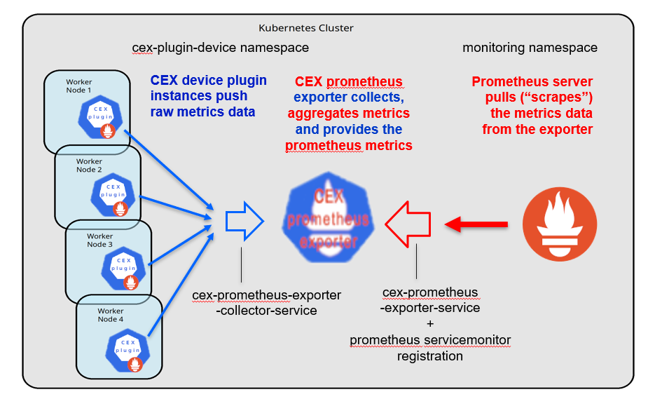
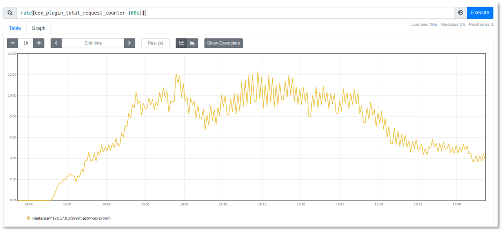
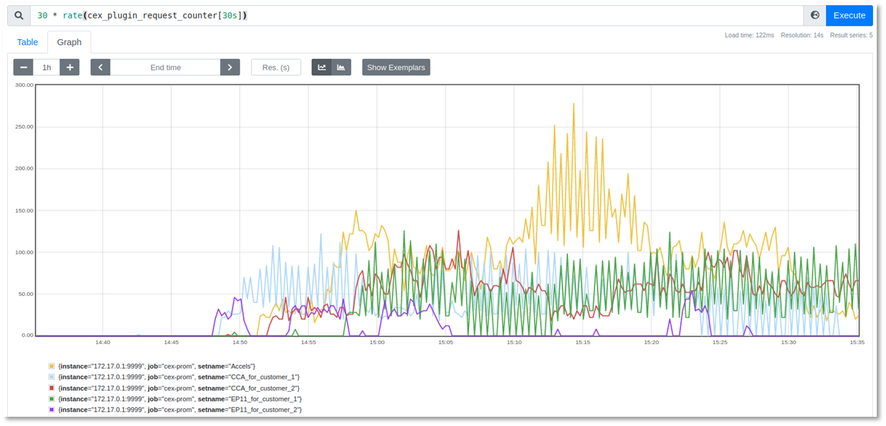
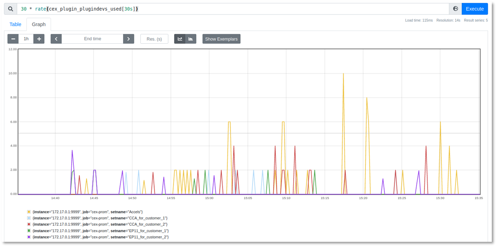
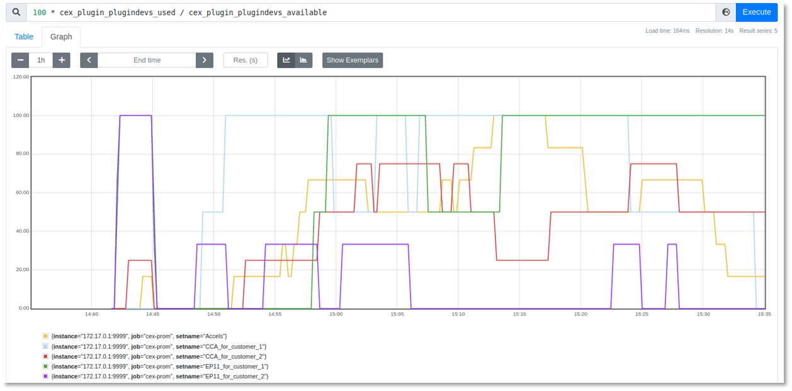

# Prometheus Support

Starting with version 1.1.0 the CEX device plug-in provides metrics
data about the CEX device resources. The metrics are offered in a
Prometheus compatible way.

The following metrics are exposed:

* Metric `cex_plugin_plugindevs_available`:

  A vector of integer literals showing the number of CEX plug-in
  devices currently available, grouped by configset name.

  For example:
  ```
  # TYPE cex_plugin_plugindevs_available gauge
  cex_plugin_plugindevs_available{setname="Accels"} 6
  cex_plugin_plugindevs_available{setname="CCA_for_customer_1"} 2
  cex_plugin_plugindevs_available{setname="CCA_for_customer_2"} 4
  cex_plugin_plugindevs_available{setname="EP11_for_customer_1"} 2
  cex_plugin_plugindevs_available{setname="EP11_for_customer_2"} 3`
  ```
* Metric `cex_plugin_plugindevs_used`:

  A vector of integer literals showing the number of CEX plug-in
  devices currently in use, grouped by configset name.

  For example:
  ```
  # TYPE cex_plugin_plugindevs_used gauge
  cex_plugin_plugindevs_used{setname="Accels"} 1
  cex_plugin_plugindevs_used{setname="CCA_for_customer_1"} 2
  cex_plugin_plugindevs_used{setname="CCA_for_customer_2"} 1
  cex_plugin_plugindevs_used{setname="EP11_for_customer_1"} 0
  cex_plugin_plugindevs_used{setname="EP11_for_customer_2"} 3
  ```
* Metric `cex_plugin_request_counter`:

  A vector of integer literals showing the sum of request counter
  values of all CEX resources managed by the CEX device plug-in
  daemonset, grouped by configset name.

  For example:
  ```
  # TYPE cex_plugin_request_counter gauge
  cex_plugin_request_counter{setname="Accels"} 44700
  cex_plugin_request_counter{setname="CCA_for_customer_1"} 36505
  cex_plugin_request_counter{setname="CCA_for_customer_2"} 40428
  cex_plugin_request_counter{setname="EP11_for_customer_1"} 24127
  cex_plugin_request_counter{setname="EP11_for_customer_2"} 21655
  ```
* Metric `cex_plugin_total_plugindevs_available`:

  A simple integer literal showing the total number of CEX plug-in
  devices currently available in the cluster. This metric provides
  the sum of all `cex_plugin_plugindevs_available` over all
  crypto configsets and is provided only for convenience.

  For example:
  ```
  # TYPE cex_plugin_total_plugindevs_available gauge
  cex_plugin_total_plugindevs_available 17
  ```
* Metric `cex_plugin_total_plugindevs_used`:

  A simple integer literal showing the total number of CEX plug-in
  devices currently in use in the cluster. This metric provides the
  sum of all `cex_plugin_plugindevs_used` over all crypto configsets
  and is provided only for convenience.

  For example:
  ```
  # TYPE cex_plugin_total_plugindevs_used gauge
  cex_plugin_total_plugindevs_used 7
  ```
* Metric `cex_plugin_total_request_counter`:

  A simple integer literal showing the total sum of all request
  counter values of all CEX resources managed by all CEX plug-in
  instances. This metric provides the sum of all
  `cex_plugin_request_counter` over all crypto configsets and is
  provided only for convenience.

  For example:
  ```
  # TYPE cex_plugin_total_request_counter gauge
  cex_plugin_total_request_counter 167415
  ```
Sample use cases that exploit these metrics are shown at the
end of this section in paragraph [Some sample use cases](some-sample-use-cases).

## Details about the Prometheus support

The _CEX Prometheus exporter_ is a Prometheus exporter that acts as a proxy
between the CEX device plug-in instances running on each cluster node and the
Prometheus server, or a similar service. The CEX Prometheus exporter collects
and aggregates the raw metrics data from the plug-ins and serves as Prometheus
client for the metrics monitoring service.



The CEX Prometheus exporter runs as a pod inside the cluster and communicates
with the CEX device plug-in instances via a cluster network through the
_cex-prometheus-exporter-collector-service_. The CEX device plug-in instances use
the cluster lookup for the metrics collector service and publish their metrics
contributions to the corresponding endpoint.

The Prometheus server, or any other compatible monitoring service, has to be
made aware of the new scrape target. This is done with a ServiceMonitor
registration and the _cex-prometheus-exporter-service_.

Note: The service port `9939` used here is registered at
[Prometheus_default port allocations](https://github.com/prometheus/prometheus/wiki/Default-port-allocations)
and should not need any adjustment.

## Setting up the Prometheus support for the CEX device plug-in

To provide the CEX Prometheus metrics the CEX Prometheus exporter
needs to run as another pod.

The prebuilt CEX device plug-in image comes with the following integrated
applications:

- The `cex-plugin` application providing the CEX device plug-in functionality
- The Prometheus exporter application `cex-prometheus-exporter`

To specify which application to use, add the `command` parameter to the config
yaml file.

- `command: ["/work/cex-plugin"]` starts the CEX device plug-in
- `command: ["/work/cex-prometheus-exporter"]` starts the CEX Prometheus exporter

If `command` is not specified, the default entrypoint application
`/work/cex-plugin` is executed.

The appendix contains sample yaml deployments for the CEX device plug-in
daemonset and the CEX Prometheus exporter pod. The CEX Prometheus exporter is a
simple application, which does not require any extended capabilities, secrets,
or special volume mounts. The CEX Prometheus exporter is not required to run
permanently, but if stopped the ability to fetch metrics data for the CEX
resources is lost.

The
[CEX device plug-in github repository](https://github.com/ibm-s390-cloud/k8s-cex-dev-plugin)
provides ready-to-use
[deployment samples](https://github.com/ibm-s390-cloud/k8s-cex-dev-plugin/tree/main/deployments)
for `kubectl` via the `kustomize` extension.

The [`cex_prom_exporter_pod.yaml`](https://github.com/ibm-s390-cloud/k8s-cex-dev-plugin/blob/main/deployments/rhocp-update/cex_prom_exporter_pod.yaml)
yaml file provides a pre-customized deployment for the CEX Prometheus exporter
pod.

In addition to the CEX Prometheus exporter pod, two service definitions are
required to permit TCP traffic. Pre-customized deployments are provided in the
CEX github repository:

* For traffic between the CEX device plug-in instances and the exporter, the
  [_cex-prometheus-exporter-collector-service_](appendix.md#sample-cex-prometheus-exporter-collector-service-yaml)
  yaml file.
* For traffic between the Prometheus server and the exporter, the
  [_cex-prometheus-exporter-service_](appendix.md#sample-cex-prometheus-exporter-service-yaml)
  yaml file.


If a new Prometheus client is available for retrieval of metrics, the Prometheus
server needs to get informed. A sample _ServiceMonitor_ definition for the CEX
Prometheus exporter is provided in the appendix
[Sample CEX Prometheus exporter servicemonitor yaml](appendix.md#sample-cex-prometheus-exporter-servicemonitor-yaml).

The github repository file
[`cex_prom_exporter_prometheus_servicemonitor.yaml`](https://github.com/ibm-s390-cloud/k8s-cex-dev-plugin/blob/main/deployments/rhocp-update/cex_prom_exporter_prometheus_servicemonitor.yaml)
provides pre-customized deployment for the ServiceMonitor.

By default the CEX Prometheus exporter pod, the two ClusterIP services, and the
ServiceMonitor all live in the _cex-plugin-device_ namespace. However, an
experienced administator can change the names, the port settings, and the
namespace preselection. The only requirement is that the CEX device plug-in
instances are able to reach the CEX Prometheus exporter pod to push their raw
data. In addition, the monitoring system needs to contact the CEX Prometheus
exporter pod to pull the metrics. For details see
[Environment variables](appendix.md#environment-variables).

## Sample Prometheus use cases for the CEX resources

* Prometheus query:
  ```
  `rate(cex_plugin_total_request_counter[60s])`
  ```
  The diagram that is generated by the query provides a basic overview of the
  CEX crypto activities within the cluster over time. It shows the summarized
  CEX crypto counters without differentiation about CEX config sets. If you are
  an experienced administator, you can use this query to discover unexpected
  crypto counter rates.

  Example output:

  

* Prometheus query:
  ```
  `30 * rate(cex_plugin_request_counter[30s])`
  ```
  The diagram that is generated by the query shows the rate of the request
  counters grouped by crypto config sets to provide a basic overview about the
  use of the individual config set CEX resources over time. However, this query
  can only express a relative utilization because a request counter increase can
  have various causes. For example, the cause could be a lightweight crypto
  operation where 100000s of operations per second per CEX resource are possible
  or the result of a heavyweight operation with RSA 4K key generations where
  only about 1000 operations per second per CEX resource are possible.

  Example output:

  

* Prometheus query:
  ```
  `30 * rate(cex_plugin_plugindevs_used[30s])`
  ```
  The diagram that is generated by the query shows the rate of used CEX plug-in
  devices over time differentiated by CEX config set. The diagram gives some
  hints how often and how long CEX resources of a certain set are used and can
  be used to adjust the provisioning of APQNs in the cluster.

  Example output:

  

* Prometheus query:
  ```
  `100 * cex_plugin_plugindevs_used / cex_plugin_plugindevs_available`
  ```
  The diagram that is generated by the query shows the utilization of the CEX
  plug-in devices in percent by calculating the fraction of used versus
  available CEX plug-in devices. A value of 100% means that all available CEX
  plug-in devices within this crypto config set are in use. Thus when a new
  container load requests a CEX resource of the given type, it is delayed until
  a CEX resource is released by a terminating container.

  You can use the results to define a threshold when you configure alert rules
  for the Prometheus server. For example, you can define the threshold to fire
  when the 90% limit is overshoot for more than 2 minutes. The Prometheus alert
  rule then triggers an action depending on the configuration of the
  Alertmanager. For example, an email or SMS is sent to the cluster
  administrator, to indicate that the number of CEX resourcees for this
  configset are not sufficient and more are needed.

  Example output:

  
